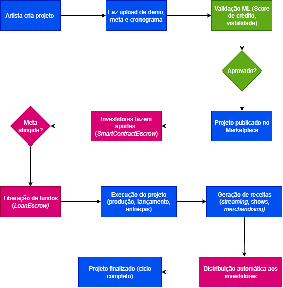

#   

Plataforma Peer-to-Peer descentralizada que permita a artistas periféricos captar microcrédito para lançamento de álbuns, videoclipes e turnês.

## Estrutura Web3 e Contratos Inteligentes

    Figura 1 - Fluxo lógico dos Smart Contracts  
    

### `ProjectRegistry`:

* `createProject()` - Registro de novo projeto.
* `updateProjectStatus()` - Atualização do status.
* `getProjectDetails()` - Consulta de dados.
* `setFundingGoal()` - Definir meta de captação.
    
**Eventos:** `ProjectCreated`, `ProjectStatusUpdated`, `FundingGoalReached`

### `LoanEscrow`

* `depositFunds()` - Receber investimentos.
* `releaseFunds()` - Liberação quando meta atingida.
* `refundInvestors()` - Reembolso em caso de falha.
* `partialRelease()` - Liberação em etapas.

**Eventos:** `FundsDeposited`, `FundsReleased`, `RefundInitiated`

### `RepaymentManager`

* `scheduleRepayment()` - Agendar pagamentos
* `processRoyaltyPayment()` - Processar royalties
* `distributePayments()` - Distribuir pro rata
* `calculateInterest()` - Calcular juros

**Eventos:**: `RepaymentScheduled`, `RoyaltyPaymentReceived`, `PaymentDistributed`

### Contrato `ReputationManager`

O ReputationManager é um contrato inteligente que calcula, atualiza e armazena o score de reputação de artistas com base em:

1. Entregas de projetos (`DeliveryRecord`);
2. Qualidade e pontualidade das entregas;
3. Histórico de pagamentos (`RepaymentManager`);
4. Métricas sociais (via oráculos);
5. Transparência e verificações;
6. Consistência de performance ao longo do tempo.

**Métodos**:  
- `updateReputation()` - Atualizar score.
- `recordDelivery()` - Registrar entregas.
- `calculateScore()` - Calcular pontuação.
- `verifyCredentials()` - Verificar credenciais.

**Estruturas de dados**: 

ReputationData

| Campo               | Tipo    | Descrição                                 |
| ------------------- | ------- | ----------------------------------------- |
| `score`             | uint256 | Score de reputação (0–1000)               |
| `projectsCompleted` | uint256 | Quantidade de projetos finalizados        |
| `projectsTotal`     | uint256 | Total de projetos iniciados               |
| `onTimePayments`    | uint256 | Pagamentos realizados no prazo            |
| `latePayments`      | uint256 | Pagamentos atrasados                      |
| `totalRaised`       | uint256 | Total de capital captado                  |
| `lastUpdated`       | uint256 | Data da última atualização                |
| `isVerified`        | bool    | Se foi verificado manualmente pela equipe |

DeliveryRecord

| Campo              | Tipo    | Descrição                                        |
| ------------------ | ------- | ------------------------------------------------ |
| `projectId`        | uint256 | ID do projeto entregue                           |
| `deliverableType`  | string  | Tipo de entrega (“demo”, “álbum”, “vídeo”, etc.) |
| `ipfsHash`         | string  | Hash IPFS da entrega                             |
| `timestamp`        | uint256 | Data da entrega                                  |
| `isOnTime`         | bool    | Indica se foi entregue no prazo                  |
| `qualityScore`     | uint256 | Nota de qualidade (1–100)                        |
| `offChainDataHash` | bytes32 | Hash de dados off-chain (prova de integridade)   |

SocialMetrics

| Campo               | Tipo     | Descrição                                          |
| ------------------- | -------- | -------------------------------------------------- |
| `followersCount`    | uint256  | Número de seguidores                               |
| `engagementRate`    | uint256  | Taxa de engajamento (0–10000 = 0–100%)             |
| `streamingPlays`    | uint256  | Número de reproduções                              |
| `verifiedPlatforms` | string[] | Plataformas verificadas (Spotify, Instagram, etc.) |
| `lastSocialUpdate`  | uint256  | Última atualização feita por um oráculo            |

