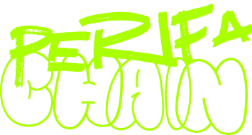
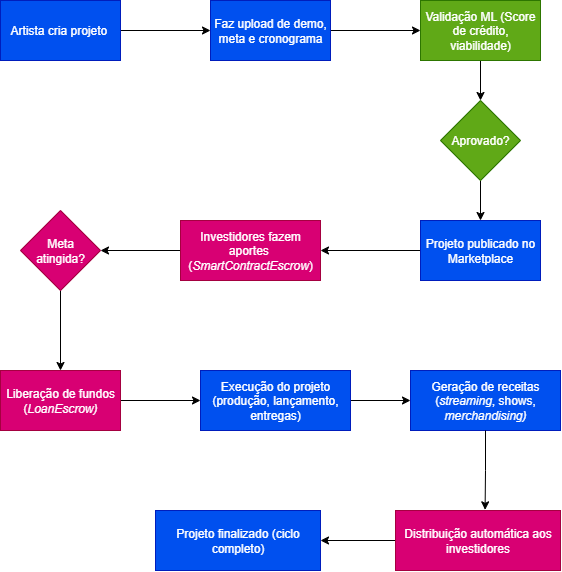

#   

Plataforma Peer-to-Peer descentralizada que permita a artistas periféricos captar microcrédito para lançamento de álbuns, videoclipes e turnês.

## Estrutura Web3 e Contratos Inteligentes

    Figura 1 - Fluxo lógico dos Smart Contracts  
    

1. `ProjectRegistry`: Gerenciar criação e registro de projetos.
    * `createProject()` - Registro de novo projeto.
    * `updateProjectStatus()` - Atualização do status.
    * `getProjectDetails()` - Consulta de dados.
    * `setFundingGoal()` - Definir meta de captação.
    
    **Eventos:** `ProjectCreated`, `ProjectStatusUpdated`, `FundingGoalReached`

2. `LoanEscrow`: Custódia e liberação condicionada de fundos.
    * `depositFunds()` - Receber investimentos.
    * `releaseFunds()` - Liberação quando meta atingida.
    * `refundInvestors()` - Reembolso em caso de falha.
    * `partialRelease()` - Liberação em etapas.

    **Eventos:** `FundsDeposited`, `FundsReleased`, `RefundInitiated`

3. `RepaymentManager`: Automação de repagamentos e distribuição.
    * `scheduleRepayment()` - Agendar pagamentos
    * `processRoyaltyPayment()` - Processar royalties
    * `distributePayments()` - Distribuir pro rata
    * `calculateInterest()` - Calcular juros

    **Eventos:**: `RepaymentScheduled`, `RoyaltyPaymentReceived`, `PaymentDistributed`

4. `ReputationManager`: Gerenciar sistema híbrido de reputação.
    * `updateReputation()` - Atualizar score
    * `recordDelivery()` - Registrar entregas
    * `calculateScore()` - Calcular pontuação
    * `verifyCredentials()` - Verificar credenciais

    **Eventos:** `ReputationUpdated`, `DeliveryRecorded`, `CredentialVerified`